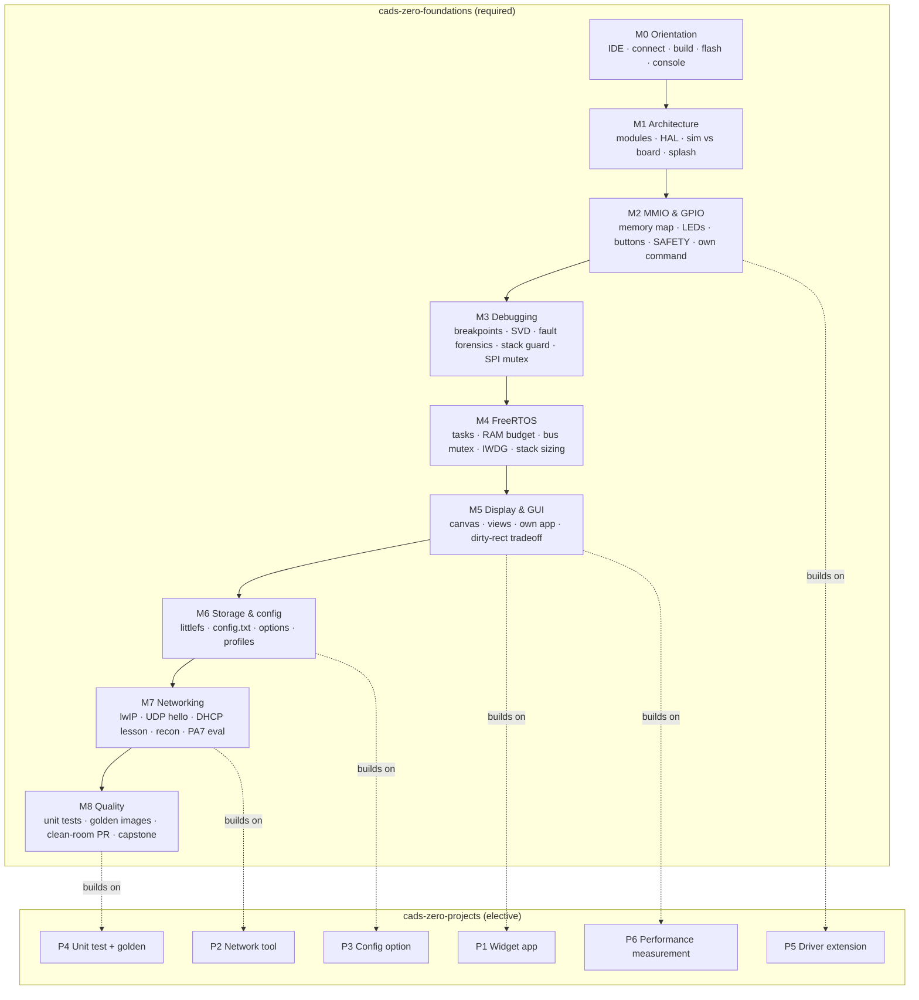

# CaDS Zero course packs

Two course packs for the CaDS Firmware Tutor, both grounded entirely in the real
firmware [CaDS Zero](https://github.com/scimbe/cads-zero) on the ITSboard
(STM32F429ZI). Every register address, file path, function name and measured
number in these steps is verifiable in that repository; nothing is invented.

| Pack | Kind | Bloom span | Steps | Time |
|---|---|---|---|---|
| [`cads-zero-foundations`](cads-zero-foundations/) | required | remember → create | 41 | ~10 h |
| [`cads-zero-projects`](cads-zero-projects/) | elective | create / evaluate | 6 | open |

The pack format, the check types and the front-matter schema are defined in
`docs/SPEC.md` (section 3.3). This file is the map and the author's cheat-sheet;
the specification is the contract.

## Learning path



Foundations steps run in a single chain: each step's `requires:` names the step
before it, so the tutor can walk a student straight through. The project tasks
carry no hard `requires` (they are independent), but each names the foundations
steps it assumes in prose and links back to the relevant docs.

## Bloom matrix

The course climbs the taxonomy deliberately: recall and comprehension in M0–M1,
application and analysis through the middle, and evaluation and creation at the
top. `apply`/`create` steps change real firmware code and check exactly that
change; `evaluate` steps ask for a defended judgement graded against a rubric.

### Foundations, step × Bloom level

| Step | remember | understand | apply | analyze | evaluate | create |
|---|:---:|:---:|:---:|:---:|:---:|:---:|
| m0-01-welcome | ● | | | | | |
| m0-02-connect | | ● | | | | |
| m0-03-build | | | ● | | | |
| m0-04-flash-console | | | ● | | | |
| m0-05-explorer | | ● | | | | |
| m1-01-module-layout | | ● | | | | |
| m1-02-hal-boundary | | ● | | | | |
| m1-03-sim-vs-board | | ● | | | | |
| m1-04-splash | | | ● | | | |
| m2-01-memory-map | | | | ● | | |
| m2-02-mmio-gpio | | | ● | | | |
| m2-03-buttons | | | | ● | | |
| m2-04-safety | | ● | | | | |
| m2-05-explorer-command | | | | | | ● |
| m3-01-gdb-breakpoints | | | ● | | | |
| m3-02-registers-svd | | | ● | | | |
| m3-03-fault-forensics | | | | ● | | |
| m3-04-stack-guard | | | | ● | | |
| m3-05-spi-mutex | | | | ● | | |
| m4-01-freertos-tasks | | | ● | | | |
| m4-02-ram-budget | | | ● | | | |
| m4-03-mutex-spi-bus | | | | ● | | |
| m4-04-iwdg-watchdog | | ● | | | | |
| m4-05-stack-sizing | | | | ● | | |
| m5-01-canvas-draw | | | ● | | | |
| m5-02-view-dispatcher | | ● | | | | |
| m5-03-own-app | | | | | | ● |
| m5-04-dirty-rect-eval | | | | | ● | |
| m6-01-littlefs | | ● | | | | |
| m6-02-config-file | | | ● | | | |
| m6-03-config-option | | | ● | | | |
| m6-04-build-profiles | | | ● | | | |
| m7-01-lwip-netif | | ● | | | | |
| m7-02-udp-hello | | | ● | | | |
| m7-03-dhcp-stack-lesson | | | | ● | | |
| m7-04-recon-tools | | | | ● | | |
| m7-05-pa7-network-eval | | | | | ● | |
| m8-01-unit-tests | | | ● | | | |
| m8-02-golden-images | | | | ● | | |
| m8-03-clean-room-pr | | | | | ● | |
| m8-04-capstone | | | | | | ● |

### Projects, step × Bloom level

| Step | create | evaluate |
|---|:---:|:---:|
| p1-widget-app | ● | |
| p2-net-tool | ● | |
| p3-config-option | ● | |
| p4-unit-test-golden | ● | |
| p5-driver-extension | ● | |
| p6-perf-measurement | | ● |

### Level counts

| Level | Foundations | Projects |
|---|---:|---:|
| remember | 1 | 0 |
| understand | 10 | 0 |
| apply | 13 | 0 |
| analyze | 9 | 0 |
| evaluate | 3 | 1 |
| create | 5 | 5 |

## Notes for course authors

The schema lives in `docs/SPEC.md` §3.3; a few conventions this pack settled on:

- **Every step ships `.de.md` and `.en.md`.** Both carry identical front matter;
  only `title` and the body prose differ. Question prompts and socratic hints
  carry both `en` and `de` inline, in both files.
- **Prefer automatic checks; use `manual` honestly.** Several diagnostic steps
  fall back to `manual` for one grounded reason: a freshly flashed board boots
  into the touchscreen app tree (`boot.autostart = 1`), which ignores plain
  console bytes, so interactive `serialExpect` against the explorer is
  unreliable. `serialExpect` is used only for deterministic boot output such as
  `RESULT: PASS`. Board-state changes (editing `/config.txt`, live
  measurements) are `manual` because no source edit exists to match.
- **`symbolInElf` needs either a real symbol or a `creates:` declaration.**
  Steps where the student writes a new symbol (a new explorer command, a new
  app, a project deliverable) declare it under `creates:` so the check passes
  once the student builds it.
- **Cross references stay resolvable.** `step:` links point only within the same
  course; cross-course prerequisites use `doc:`/`file:` links and prose.
- **Validate before you commit.** `scripts/validate-courses.py <cads-zero-root>`
  checks schema, cross-links, repository paths, `symbolInElf` symbols against the
  built ELF, bilingual coverage and Bloom levels. It runs on stdlib Python and
  uses PyYAML when available.

Run it as:

```bash
scripts/validate-courses.py /path/to/cads-zero \
  --nm /path/to/arm-none-eabi-nm
```
