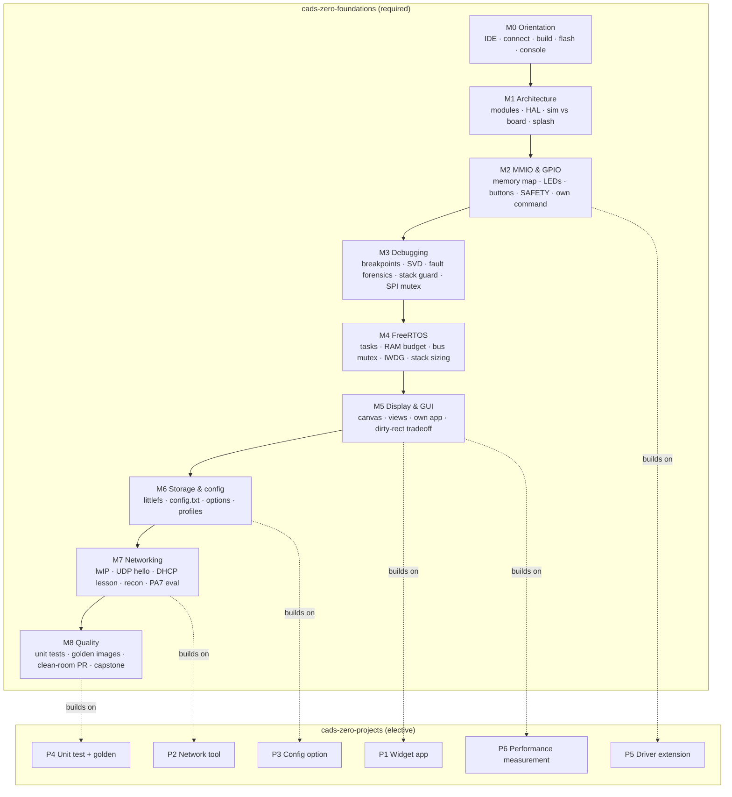
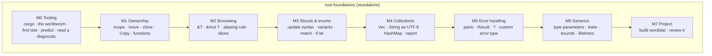

# Course packs

Course packs for the CaDS Tutor. The two firmware packs are grounded entirely in
the real firmware [CaDS Zero](https://github.com/scimbe/cads-zero) on the
ITSboard (STM32F429ZI); every register address, file path, function name and
measured number in them is verifiable in that repository. The language packs are
grounded in the corresponding official documentation, carried as content packs of
the tutor platform. Nothing in any of them is invented.

| Pack | Track | Kind | Bloom span | Steps | Time |
|---|---|---|---|---|---|
| [`cads-zero-foundations`](cads-zero-foundations/) | firmware | required | remember → create | 41 | ~10 h |
| [`cads-zero-projects`](cads-zero-projects/) | firmware | elective | create / evaluate | 6 | open |
| [`rust-foundations`](rust-foundations/) | language | standalone | remember → create | 31 | ~12 h |

The firmware packs need the board; `javascript-foundations` needs nothing but
Node 22 and its starter workspace at `workspaces/javascript-foundations`.

The pack format, the check types and the front-matter schema are defined in
`docs/SPEC.md` (section 3.3, plus Addendum v1.1 for `command`, `testSuite`,
`predict`, `scaffold`, `recallFrom`, `misconceptions` and module reflection).
This file is the map and the author's cheat-sheet; the specification is the
contract.

## Firmware track: learning path



Foundations steps run in a single chain: each step's `requires:` names the step
before it, so the tutor can walk a student straight through. The project tasks
carry no hard `requires` (they are independent), but each names the foundations
steps it assumes in prose and links back to the relevant docs.

### JavaScript learning path

`javascript-foundations` is a separate track with no firmware prerequisite. It
runs in one chain as well, M0 through the capstone, and every step is checked by
`node --test` against the exercise files in `workspaces/javascript-foundations`.


Grounding comes from the tutor platform's `javascript` content pack, which
carries seven chapters of the MDN *JavaScript Guide*. The three topics the pack
does not cover - promises, ES modules and class syntax - are supplied by the MDN
guide pages reproduced verbatim under
[`javascript-foundations/sources/`](javascript-foundations/sources/), licensed
CC-BY-SA 2.5 by Mozilla and individual contributors.

## Bloom matrix

The course climbs the taxonomy deliberately: recall and comprehension in M0–M1,
application and analysis through the middle, and evaluation and creation at the
top. `apply`/`create` steps change real firmware code and check exactly that
change; `evaluate` steps ask for a defended judgement graded against a rubric.

### Foundations, step × Bloom level

| Step | remember | understand | apply | analyze | evaluate | create |
|---|:---:|:---:|:---:|:---:|:---:|:---:|
| m0-01-welcome | ● | | | | | |
| m0-02-connect | | ● | | | | |
| m0-03-build | | | ● | | | |
| m0-04-flash-console | | | ● | | | |
| m0-05-explorer | | ● | | | | |
| m1-01-module-layout | | ● | | | | |
| m1-02-hal-boundary | | ● | | | | |
| m1-03-sim-vs-board | | ● | | | | |
| m1-04-splash | | | ● | | | |
| m2-01-memory-map | | | | ● | | |
| m2-02-mmio-gpio | | | ● | | | |
| m2-03-buttons | | | | ● | | |
| m2-04-safety | | ● | | | | |
| m2-05-explorer-command | | | | | | ● |
| m3-01-gdb-breakpoints | | | ● | | | |
| m3-02-registers-svd | | | ● | | | |
| m3-03-fault-forensics | | | | ● | | |
| m3-04-stack-guard | | | | ● | | |
| m3-05-spi-mutex | | | | ● | | |
| m4-01-freertos-tasks | | | ● | | | |
| m4-02-ram-budget | | | ● | | | |
| m4-03-mutex-spi-bus | | | | ● | | |
| m4-04-iwdg-watchdog | | ● | | | | |
| m4-05-stack-sizing | | | | ● | | |
| m5-01-canvas-draw | | | ● | | | |
| m5-02-view-dispatcher | | ● | | | | |
| m5-03-own-app | | | | | | ● |
| m5-04-dirty-rect-eval | | | | | ● | |
| m6-01-littlefs | | ● | | | | |
| m6-02-config-file | | | ● | | | |
| m6-03-config-option | | | ● | | | |
| m6-04-build-profiles | | | ● | | | |
| m7-01-lwip-netif | | ● | | | | |
| m7-02-udp-hello | | | ● | | | |
| m7-03-dhcp-stack-lesson | | | | ● | | |
| m7-04-recon-tools | | | | ● | | |
| m7-05-pa7-network-eval | | | | | ● | |
| m8-01-unit-tests | | | ● | | | |
| m8-02-golden-images | | | | ● | | |
| m8-03-clean-room-pr | | | | | ● | |
| m8-04-capstone | | | | | | ● |

### Projects, step × Bloom level

| Step | create | evaluate |
|---|:---:|:---:|
| p1-widget-app | ● | |
| p2-net-tool | ● | |
| p3-config-option | ● | |
| p4-unit-test-golden | ● | |
| p5-driver-extension | ● | |
| p6-perf-measurement | | ● |

### JavaScript foundations, step × Bloom level

| Step | scaffold | remember | understand | apply | analyze | evaluate | create |
|---|---|:---:|:---:|:---:|:---:|:---:|:---:|
| m0-01-using-the-ide | worked |  |  | ● |  |  |  |
| m0-02-first-run | worked | ● |  |  |  |  |  |
| m0-03-read-a-test | worked |  | ● |  |  |  |  |
| m0-04-modules | faded |  |  | ● |  |  |  |
| m0-05-predict-output | independent |  | ● |  |  |  |  |
| m1-01-let-const | worked |  | ● |  |  |  |  |
| m1-02-types-typeof | faded |  |  | ● |  |  |  |
| m1-03-coercion-nan | faded |  |  |  | ● |  |  |
| m1-04-equality | independent |  |  |  | ● |  |  |
| m2-01-if-switch | worked |  |  | ● |  |  |  |
| m2-02-truthy-falsy | faded |  |  |  | ● |  |  |
| m2-03-try-catch-finally | faded |  |  | ● |  |  |  |
| m2-04-error-objects | independent |  |  |  |  |  | ● |
| m3-01-for-and-while | worked |  |  | ● |  |  |  |
| m3-02-off-by-one | faded |  |  |  | ● |  |  |
| m3-03-for-of-and-in | faded |  |  |  | ● |  |  |
| m3-04-break-continue | independent |  |  | ● |  |  |  |
| m4-01-declare-and-call | worked |  | ● |  |  |  |  |
| m4-02-parameters | faded |  |  | ● |  |  |  |
| m4-03-closures | faded |  |  |  | ● |  |  |
| m4-04-arrow-and-this | independent |  |  |  | ● |  |  |
| m5-01-objects | worked |  |  | ● |  |  |  |
| m5-02-optional-chaining | faded |  |  | ● |  |  |  |
| m5-03-arrays | faded |  |  | ● |  |  |  |
| m5-04-transformations | independent |  |  |  | ● |  |  |
| m6-01-promises | worked |  | ● |  |  |  |  |
| m6-02-async-await | faded |  |  | ● |  |  |  |
| m6-03-async-errors | faded |  |  |  | ● |  |  |
| m6-04-concurrency | independent |  |  |  |  | ● |  |
| m7-01-capstone-design | faded |  |  |  |  | ● |  |
| m7-02-capstone-build | independent |  |  |  |  |  | ● |

### Level counts

| Level | Foundations | Projects | JavaScript |
|---|---:|---:|---:|
| remember | 1 | 0 | 1 |
| understand | 10 | 0 | 5 |
| apply | 13 | 0 | 12 |
| analyze | 9 | 0 | 9 |
| evaluate | 3 | 1 | 2 |
| create | 5 | 5 | 2 |

`javascript-foundations` climbs the same way the firmware pack does, but it also carries the Addendum v1.1 scaffolding: nine `worked` steps that show the whole move, fourteen `faded` steps that leave the decisive line to the student, and eight `independent` steps. Every module holds at least one `predict` task, `recallFrom` brings an earlier step's question back from M1 onwards, and every step has at least one automatic check.
## Notes for course authors

## Rust track: learning path

`rust-foundations` is a standalone pack with its own workspace,
[`workspaces/rust-foundations`](../workspaces/rust-foundations/). It shares no
prerequisites with the firmware packs and needs no hardware.



Like the firmware pack, the steps form a single chain: each step's `requires:`
names the one before it. From M2 onward every step also carries `recallFrom:`,
naming one or two earlier steps the panel may re-ask a question from when the
step is opened.

Grounding is the platform pack `rust` (threshold 9.0), which indexes chapters
4, 5, 6, 8, 9 and 10 of *The Rust Programming Language* and supplies the fifteen
`rust-ch*` objectives. Three further objectives -- `rust-tooling-cargo`,
`rust-tooling-diagnostics` and `rust-project-cli` -- are declared in
[`rust-foundations/curriculum.json`](rust-foundations/curriculum.json) with
empty `sourceDocIds`, because the pack indexes no cargo or tooling chapter and
citing ownership chunks for a cargo objective would be dishonest grounding.

## Rust track: Bloom matrix

| Step | Module | Bloom | Scaffold | Automatic checks |
|---|---|---|---|---|
| m0-01-welcome | M0 | remember | worked | command, question |
| m0-02-workbench | M0 | apply | worked | command ×2, question |
| m0-03-first-test | M0 | apply | worked | testSuite, question |
| m0-04-predict-output | M0 | understand | faded | predict → command, testSuite |
| m0-05-compiler-errors | M0 | analyze | independent | command, question |
| m1-01-scope-and-move | M1 | understand | worked | predict → command, testSuite |
| m1-02-move-vs-clone | M1 | apply | faded | testSuite, question |
| m1-03-copy-types | M1 | understand | faded | testSuite, fileMatches+fileNotMatches, question |
| m1-04-ownership-and-functions | M1 | apply | independent | testSuite, question |
| m2-01-shared-references | M2 | apply | worked | predict → command, testSuite |
| m2-02-mutable-references | M2 | apply | faded | testSuite, question |
| m2-03-aliasing-rule | M2 | analyze | faded | command, testSuite, question |
| m2-04-slices | M2 | apply | independent | predict → command, testSuite |
| m3-01-structs | M3 | apply | worked | testSuite, question |
| m3-02-enums | M3 | understand | faded | testSuite, question |
| m3-03-match | M3 | apply | faded | predict → command, testSuite |
| m3-04-if-let | M3 | apply | independent | testSuite, question |
| m4-01-vectors | M4 | apply | worked | testSuite, question |
| m4-02-strings | M4 | analyze | faded | predict → command, testSuite, command |
| m4-03-hash-maps | M4 | apply | faded | testSuite, question |
| m4-04-collections-report | M4 | analyze | independent | testSuite, question |
| m5-01-panic-vs-result | M5 | understand | worked | predict → command, testSuite, command |
| m5-02-result | M5 | apply | worked | testSuite, question |
| m5-03-question-mark | M5 | apply | faded | testSuite, question |
| m5-04-custom-error | M5 | analyze | independent | testSuite, question |
| m6-01-generics | M6 | understand | worked | testSuite, question |
| m6-02-traits | M6 | apply | faded | testSuite, question |
| m6-03-trait-bounds | M6 | apply | faded | testSuite, question |
| m6-04-lifetimes | M6 | analyze | independent | predict → command, command, testSuite |
| m7-01-wordstat | M7 | create | independent | testSuite, command ×2 |
| m7-02-review | M7 | evaluate | independent | command ×2, question |

### Level and scaffold counts

| Level | Steps | | Scaffold | Steps |
|---|---:|---|---|---:|
| remember | 1 | | worked | 10 |
| understand | 6 | | faded | 12 |
| apply | 16 | | independent | 9 |
| analyze | 6 | | | |
| evaluate | 1 | | | |
| create | 1 | | | |

Every module M0--M6 opens with a `worked` step and closes with an `independent`
one, and every module M0--M6 carries at least one `predict` task. M7, the final
project, is `independent` throughout by design.

## Notes for the Rust pack

- **Nothing is quoted from memory.** Every `misconceptions:` regex was captured
  from a real `rustc 1.94.0` run on the workspace's own snippets: E0382, E0499,
  E0502, E0596, E0507, E0308, E0277, E0106, E0004, E0046, E0063, E0369, E0597,
  the `let...else` divergence message, the `str cannot be indexed` message and
  the `byte index N is not a char boundary` panic. Re-verify them after a
  toolchain bump; the messages are stable but not contractual.
- **Three kinds of file, three roles.** `src/` holds the exercises the student
  edits, `tests/` the finished specification, `examples/` the runnable programs
  for `predict` tasks, `snippets/` programs that deliberately do not compile and
  are never edited, and `repair/` two broken programs the student fixes.
  `m6-04-lifetimes` has the same broken program in both `snippets/` and
  `repair/`, on purpose: the prediction check must keep reporting the original
  diagnostic after the repair file has been fixed.
- **Every step that runs something states the full operating path.** Menu,
  key and the command to copy sit in a `Running it` section at the foot of the
  step, generated from that step's own checks so the command in the prose and
  the command the Check button runs cannot drift apart. It also names what you
  see, how long it takes, how you know the command finished, and which of the
  three panel tabs the output is in -- looking in `Problems` or `Output`
  instead of `Terminal` is the most common way to lose ten minutes. There are
  no "as before" references: `m0-02-workbench` teaches the window once, and
  every later step still repeats the path it needs.

- **Two tooling misconceptions attach themselves automatically** wherever they
  can actually fire: `could not find Cargo.toml` (terminal in the wrong folder)
  and `no test target named` (wrong step id after `--test`). Looking in the
  wrong panel and closing the terminal produce no output at all, so they are
  prose in the `Running it` section rather than regexes that could never match.

- **Checks that pass without a solution, and why.** Fifteen checks carry
  `seedMustFail: false`, which switches off the negative half of the probe.
  All thirteen test a fixed artifact rather than student code: the environment
  probes in `m0-01-welcome` (`cargo --version`, `cargo build` -- the workspace
  compiles from the start because unsolved exercises are `todo!()`),
  `cargo fmt --check` in `m7-02-review`, and every `predict` check plus the two
  standalone snippet compilations, which assert that a read-only file still
  produces exactly the documented diagnostic. Every check that grades student
  work does fail without the solution, and the validator proves it:
  39 probes, 39 ok, 0 failed.
- **`#[should_panic]` and test-list parsing.** cargo prints such a test as
  `test <name> - should panic ... ok`, with the marker between the name and the
  result. `m5-01-panic-vs-result` therefore pairs its `testSuite` check with a
  `command` check asserting `test result: ok. 8 passed; 0 failed`, so the four
  panic tests are covered whatever a list parser makes of that marker.
- **Reference solutions live outside the seed, in two views.**
  `workspaces/rust-foundations/solutions/src/**` and `.../solutions/repair/**`
  are the complete finished workspace at the workspace's own relative paths --
  the overlay `--solutions` expects. `.../solutions/by-step/<step-id>/` holds
  the same files split per step, which is how a single step can be probed in
  isolation while it is being written. Neither is seeded into the lab image.

- **`recallFrom` may only name a step that has a `question` task.** The recall
  card re-asks one, so a target without one is silently dead; the validator
  warns about it.

## Validating

```bash
# Rust pack: schema, links, and every check run with and without the solution
python3 scripts/validate-courses.py workspaces/rust-foundations \
  --courses-dir courses --only rust-foundations \
  --solutions workspaces/rust-foundations/solutions

# Firmware packs: schema, links, and symbols against the built ELF
python3 scripts/validate-courses.py /path/to/cads-zero \
  --only cads-zero-foundations --nm /path/to/arm-none-eabi-nm
```

`--only` matters: a pack is checked against the PROJECT_ROOT you pass, and the
firmware packs' paths do not exist in the Rust workspace or the other way round.

## Notes for the firmware packs

The schema lives in `docs/SPEC.md` §3.3; a few conventions this pack settled on:

- **Every step ships `.de.md` and `.en.md`.** Both carry identical front matter;
  only `title` and the body prose differ. Question prompts and socratic hints
  carry both `en` and `de` inline, in both files.
- **Prefer automatic checks; use `manual` honestly.** Several diagnostic steps
  fall back to `manual` for one grounded reason: a freshly flashed board boots
  into the touchscreen app tree (`boot.autostart = 1`), which ignores plain
  console bytes, so interactive `serialExpect` against the explorer is
  unreliable. `serialExpect` is used only for deterministic boot output such as
  `RESULT: PASS`. Board-state changes (editing `/config.txt`, live
  measurements) are `manual` because no source edit exists to match.
- **`symbolInElf` needs either a real symbol or a `creates:` declaration.**
  Steps where the student writes a new symbol (a new explorer command, a new
  app, a project deliverable) declare it under `creates:` so the check passes
  once the student builds it.
- **Cross references stay resolvable.** `step:` links point only within the same
  course; cross-course prerequisites use `doc:`/`file:` links and prose.
- **A language pack points `project.root` at its own workspace.**
  `javascript-foundations` sets it to `javascript-foundations`, so every
  `file:`/`doc:` link and every `sources:` entry is a path inside
  `workspaces/javascript-foundations` and is checked against it. Because the
  validator resolves those paths against one project root, validate one pack at a
  time with `--only`.
- **A check that cannot fail is worthless.** Every `testSuite` and `command`
  check is probed twice by `--solutions`: it must pass with the reference
  solution and fail on the untouched seed workspace. The one honest exception is
  a toolchain probe such as `node --version`, which declares
  `seedMustFail: false`.
- **Validate before you commit.** `scripts/validate-courses.py <project-root>`
  checks schema, cross-links, repository paths, `symbolInElf` symbols against the
  built ELF, bilingual coverage, Bloom levels, scaffold and recall targets. It
  runs on stdlib Python and uses PyYAML when available.

Run it as:

```bash
# firmware packs, against a cads-zero checkout
scripts/validate-courses.py /path/to/cads-zero \
  --nm /path/to/arm-none-eabi-nm

# javascript pack, against its starter workspace, with the solution probe
python3 scripts/validate-courses.py workspaces/javascript-foundations \
  --courses-dir courses --only javascript-foundations \
  --solutions workspaces/javascript-foundations/solutions
```
