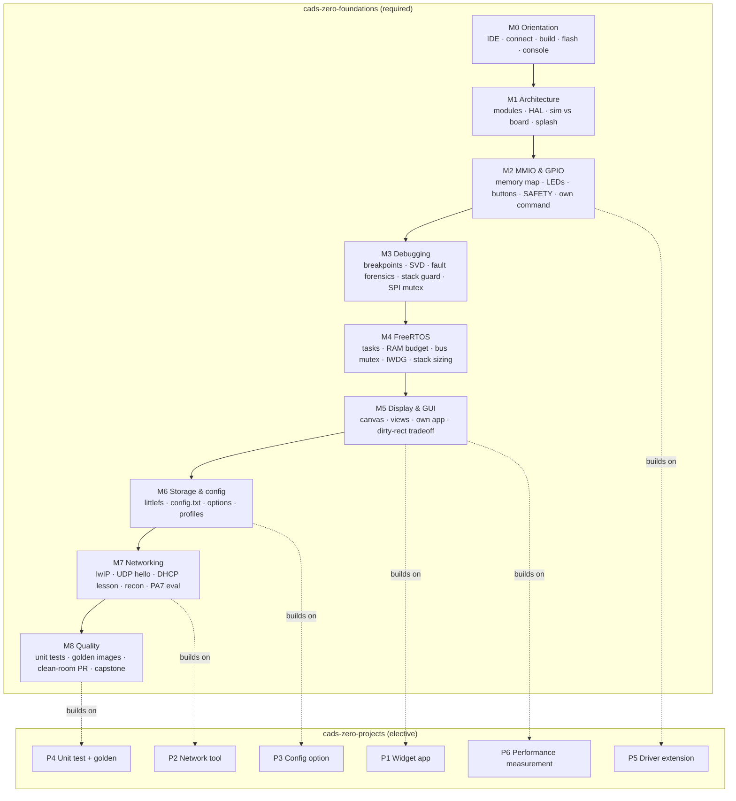

# Course packs

Course packs for the CaDS Tutor. The two firmware packs are grounded entirely in
the real firmware [CaDS Zero](https://github.com/scimbe/cads-zero) on the
ITSboard (STM32F429ZI); every register address, file path, function name and
measured number in them is verifiable in that repository. The language packs are
grounded in the corresponding official documentation, carried as content packs of
the tutor platform. Nothing in any of them is invented.

| Pack | Track | Kind | Bloom span | Steps | Time |
|---|---|---|---|---|---|
| [`cads-zero-foundations`](cads-zero-foundations/) | firmware | required | remember → create | 41 | ~10 h |
| [`cads-zero-projects`](cads-zero-projects/) | firmware | elective | create / evaluate | 6 | open |
| [`javascript-foundations`](javascript-foundations/) | javascript | standalone | remember → create | 31 | ~9 h |

The firmware packs need the board; `javascript-foundations` needs nothing but
Node 22 and its starter workspace at `workspaces/javascript-foundations`.

The pack format, the check types and the front-matter schema are defined in
`docs/SPEC.md` (section 3.3, plus Addendum v1.1 for `command`, `testSuite`,
`predict`, `scaffold`, `recallFrom`, `misconceptions` and module reflection).
This file is the map and the author's cheat-sheet; the specification is the
contract.

## Learning path



Foundations steps run in a single chain: each step's `requires:` names the step
before it, so the tutor can walk a student straight through. The project tasks
carry no hard `requires` (they are independent), but each names the foundations
steps it assumes in prose and links back to the relevant docs.

### JavaScript learning path

`javascript-foundations` is a separate track with no firmware prerequisite. It
runs in one chain as well, M0 through the capstone, and every step is checked by
`node --test` against the exercise files in `workspaces/javascript-foundations`.


Grounding comes from the tutor platform's `javascript` content pack, which
carries seven chapters of the MDN *JavaScript Guide*. The three topics the pack
does not cover - promises, ES modules and class syntax - are supplied by the MDN
guide pages reproduced verbatim under
[`javascript-foundations/sources/`](javascript-foundations/sources/), licensed
CC-BY-SA 2.5 by Mozilla and individual contributors.

## Bloom matrix

The course climbs the taxonomy deliberately: recall and comprehension in M0–M1,
application and analysis through the middle, and evaluation and creation at the
top. `apply`/`create` steps change real firmware code and check exactly that
change; `evaluate` steps ask for a defended judgement graded against a rubric.

### Foundations, step × Bloom level

| Step | remember | understand | apply | analyze | evaluate | create |
|---|:---:|:---:|:---:|:---:|:---:|:---:|
| m0-01-welcome | ● | | | | | |
| m0-02-connect | | ● | | | | |
| m0-03-build | | | ● | | | |
| m0-04-flash-console | | | ● | | | |
| m0-05-explorer | | ● | | | | |
| m1-01-module-layout | | ● | | | | |
| m1-02-hal-boundary | | ● | | | | |
| m1-03-sim-vs-board | | ● | | | | |
| m1-04-splash | | | ● | | | |
| m2-01-memory-map | | | | ● | | |
| m2-02-mmio-gpio | | | ● | | | |
| m2-03-buttons | | | | ● | | |
| m2-04-safety | | ● | | | | |
| m2-05-explorer-command | | | | | | ● |
| m3-01-gdb-breakpoints | | | ● | | | |
| m3-02-registers-svd | | | ● | | | |
| m3-03-fault-forensics | | | | ● | | |
| m3-04-stack-guard | | | | ● | | |
| m3-05-spi-mutex | | | | ● | | |
| m4-01-freertos-tasks | | | ● | | | |
| m4-02-ram-budget | | | ● | | | |
| m4-03-mutex-spi-bus | | | | ● | | |
| m4-04-iwdg-watchdog | | ● | | | | |
| m4-05-stack-sizing | | | | ● | | |
| m5-01-canvas-draw | | | ● | | | |
| m5-02-view-dispatcher | | ● | | | | |
| m5-03-own-app | | | | | | ● |
| m5-04-dirty-rect-eval | | | | | ● | |
| m6-01-littlefs | | ● | | | | |
| m6-02-config-file | | | ● | | | |
| m6-03-config-option | | | ● | | | |
| m6-04-build-profiles | | | ● | | | |
| m7-01-lwip-netif | | ● | | | | |
| m7-02-udp-hello | | | ● | | | |
| m7-03-dhcp-stack-lesson | | | | ● | | |
| m7-04-recon-tools | | | | ● | | |
| m7-05-pa7-network-eval | | | | | ● | |
| m8-01-unit-tests | | | ● | | | |
| m8-02-golden-images | | | | ● | | |
| m8-03-clean-room-pr | | | | | ● | |
| m8-04-capstone | | | | | | ● |

### Projects, step × Bloom level

| Step | create | evaluate |
|---|:---:|:---:|
| p1-widget-app | ● | |
| p2-net-tool | ● | |
| p3-config-option | ● | |
| p4-unit-test-golden | ● | |
| p5-driver-extension | ● | |
| p6-perf-measurement | | ● |

### JavaScript foundations, step × Bloom level

| Step | scaffold | remember | understand | apply | analyze | evaluate | create |
|---|---|:---:|:---:|:---:|:---:|:---:|:---:|
| m0-01-using-the-ide | worked |  |  | ● |  |  |  |
| m0-02-first-run | worked | ● |  |  |  |  |  |
| m0-03-read-a-test | worked |  | ● |  |  |  |  |
| m0-04-modules | faded |  |  | ● |  |  |  |
| m0-05-predict-output | independent |  | ● |  |  |  |  |
| m1-01-let-const | worked |  | ● |  |  |  |  |
| m1-02-types-typeof | faded |  |  | ● |  |  |  |
| m1-03-coercion-nan | faded |  |  |  | ● |  |  |
| m1-04-equality | independent |  |  |  | ● |  |  |
| m2-01-if-switch | worked |  |  | ● |  |  |  |
| m2-02-truthy-falsy | faded |  |  |  | ● |  |  |
| m2-03-try-catch-finally | faded |  |  | ● |  |  |  |
| m2-04-error-objects | independent |  |  |  |  |  | ● |
| m3-01-for-and-while | worked |  |  | ● |  |  |  |
| m3-02-off-by-one | faded |  |  |  | ● |  |  |
| m3-03-for-of-and-in | faded |  |  |  | ● |  |  |
| m3-04-break-continue | independent |  |  | ● |  |  |  |
| m4-01-declare-and-call | worked |  | ● |  |  |  |  |
| m4-02-parameters | faded |  |  | ● |  |  |  |
| m4-03-closures | faded |  |  |  | ● |  |  |
| m4-04-arrow-and-this | independent |  |  |  | ● |  |  |
| m5-01-objects | worked |  |  | ● |  |  |  |
| m5-02-optional-chaining | faded |  |  | ● |  |  |  |
| m5-03-arrays | faded |  |  | ● |  |  |  |
| m5-04-transformations | independent |  |  |  | ● |  |  |
| m6-01-promises | worked |  | ● |  |  |  |  |
| m6-02-async-await | faded |  |  | ● |  |  |  |
| m6-03-async-errors | faded |  |  |  | ● |  |  |
| m6-04-concurrency | independent |  |  |  |  | ● |  |
| m7-01-capstone-design | faded |  |  |  |  | ● |  |
| m7-02-capstone-build | independent |  |  |  |  |  | ● |

### Level counts

| Level | Foundations | Projects | JavaScript |
|---|---:|---:|---:|
| remember | 1 | 0 | 1 |
| understand | 10 | 0 | 5 |
| apply | 13 | 0 | 12 |
| analyze | 9 | 0 | 9 |
| evaluate | 3 | 1 | 2 |
| create | 5 | 5 | 2 |

`javascript-foundations` climbs the same way the firmware pack does, but it also carries the Addendum v1.1 scaffolding: nine `worked` steps that show the whole move, fourteen `faded` steps that leave the decisive line to the student, and eight `independent` steps. Every module holds at least one `predict` task, `recallFrom` brings an earlier step's question back from M1 onwards, and every step has at least one automatic check.
## Notes for course authors

The schema lives in `docs/SPEC.md` §3.3; a few conventions this pack settled on:

- **Every step ships `.de.md` and `.en.md`.** Both carry identical front matter;
  only `title` and the body prose differ. Question prompts and socratic hints
  carry both `en` and `de` inline, in both files.
- **Prefer automatic checks; use `manual` honestly.** Several diagnostic steps
  fall back to `manual` for one grounded reason: a freshly flashed board boots
  into the touchscreen app tree (`boot.autostart = 1`), which ignores plain
  console bytes, so interactive `serialExpect` against the explorer is
  unreliable. `serialExpect` is used only for deterministic boot output such as
  `RESULT: PASS`. Board-state changes (editing `/config.txt`, live
  measurements) are `manual` because no source edit exists to match.
- **`symbolInElf` needs either a real symbol or a `creates:` declaration.**
  Steps where the student writes a new symbol (a new explorer command, a new
  app, a project deliverable) declare it under `creates:` so the check passes
  once the student builds it.
- **Cross references stay resolvable.** `step:` links point only within the same
  course; cross-course prerequisites use `doc:`/`file:` links and prose.
- **A language pack points `project.root` at its own workspace.**
  `javascript-foundations` sets it to `javascript-foundations`, so every
  `file:`/`doc:` link and every `sources:` entry is a path inside
  `workspaces/javascript-foundations` and is checked against it. Because the
  validator resolves those paths against one project root, validate one pack at a
  time with `--only`.
- **A check that cannot fail is worthless.** Every `testSuite` and `command`
  check is probed twice by `--solutions`: it must pass with the reference
  solution and fail on the untouched seed workspace. The one honest exception is
  a toolchain probe such as `node --version`, which declares
  `seedMustFail: false`.
- **Validate before you commit.** `scripts/validate-courses.py <project-root>`
  checks schema, cross-links, repository paths, `symbolInElf` symbols against the
  built ELF, bilingual coverage, Bloom levels, scaffold and recall targets. It
  runs on stdlib Python and uses PyYAML when available.

Run it as:

```bash
# firmware packs, against a cads-zero checkout
scripts/validate-courses.py /path/to/cads-zero \
  --nm /path/to/arm-none-eabi-nm

# javascript pack, against its starter workspace, with the solution probe
python3 scripts/validate-courses.py workspaces/javascript-foundations \
  --courses-dir courses --only javascript-foundations \
  --solutions workspaces/javascript-foundations/solutions
```
