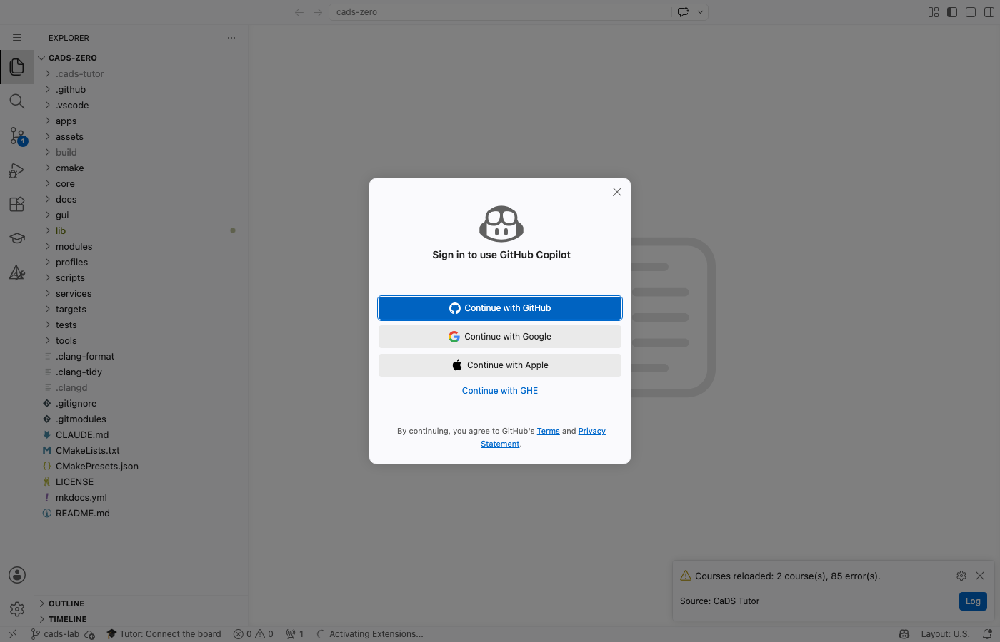

# GitHub Copilot in der Tutor-Umgebung: Machbarkeitsprüfung mit Belegen

**Stand:** 2026-09-06 · **Zweig:** `stream-copilot` (aus `origin/next`, 615bc78)
**Auftrag:** Können Studierende ihr eigenes Copilot-Konto in unserer Umgebung nutzen, und kann das
Tutor-Plugin — nach dem Vorbild von [vscode-lm-proxy](https://github.com/ryonakae/vscode-lm-proxy) —
zwischen llm2/Labor und Copilot umschalten?

Jede Aussage hier trägt einen Messwert, eine Protokollzeile oder eine Quelle. Was ich nicht prüfen
konnte, steht in [§8](#8-was-ich-nicht-prüfen-konnte) — nicht als Vermutung im Fließtext.

---

## 1 — Die drei Befunde, die die Ausgangslage verschieben

Die Ausgangslage im Auftrag war an drei Stellen überholt. Alle drei sind gemessen, nicht recherchiert.

**B-I. Copilot Chat ist bereits in unserem Bild — als eingebaute Erweiterung, MIT-lizenziert.**
`codercom/code-server:latest`, aus dem unser `Dockerfile` (Zeile 18) baut, liefert
`/usr/lib/code-server/lib/vscode/extensions/copilot/` mit:

```
{"name":"copilot-chat","displayName":"GitHub Copilot","version":"0.63.0",
 "completionsCoreVersion":"1.378.1799","publisher":"GitHub",
 "license":"SEE LICENSE IN LICENSE.txt","engines":{"vscode":"^1.135.0"}}
```

`LICENSE.txt` ist die **MIT-Lizenz**, Copyright Microsoft Corporation. Die Frage nach Open VSX, nach dem
Marktplatz-Verbot und nach der VSIX-Weiterverteilung (Issues #6426/#6427) stellt sich damit **nicht mehr**:
wir laden nichts herunter und verteilen nichts weiter, was nicht schon Bestandteil des Basisbildes wäre.

Grund: `microsoft/vscode-copilot-chat` wurde am **2026-05-20 archiviert**, die Entwicklung ist nach
`microsoft/vscode` gewandert; damit liegt der Code in dem Baum, aus dem code-server gebaut wird.

**B-II. GitHub Models ist tot.** Weg C existiert nicht mehr. Gemessen, unangemeldet:

```
POST https://models.github.ai/inference/chat/completions
  → http=410  time=0.353 s
  {"error":{"code":"github_models_retirement_brownout",
            "message":"GitHub Models is temporarily unavailable as part of a scheduled retirement brownout."}}
POST https://models.inference.ai.azure.com/chat/completions
  → http=000  (Host löst nicht mehr auf)
```

GitHub Changelog vom 2026-07-30, wörtlich: *„GitHub Models is now retired. The playground, model catalog,
inference API, and bring your own key (BYOK) are no longer available to any customer."* Als Ersatz nennt
GitHub *„Microsoft Foundry offers a broad model catalog"* und *„GitHub Copilot gives you access to a range
of models"*.

**B-III. Das VS-Code-1.135-Modell-Provider-API ist offen und funktioniert in code-server.**
Eine beliebige Drittanbieter-Erweiterung darf einen eigenen Modell-Anbieter registrieren, ohne
Proposed-API und ohne Signatur. Damit ist der Umschalter kein Umgehungs-, sondern ein Standardweg
(Messprotokoll in [§2](#2-messprotokoll-1--was-kann-code-server-wirklich)).

---

## 2 — Messprotokoll 1: Was kann code-server wirklich?

**Aufbau.** Bild `cads-firmware-lab:dev` (unser Bild, `next`), Container `copilot-probe`, `--memory 1500m`,
Port `127.0.0.1:8087`, Docker = Colima (VM: 5.9 GiB, 4 CPU). Browser: Playwright-Chromium
**149.0.7827.55** (headless shell 1228) vom Mac aus — also dieselbe Topologie wie bei Studierenden
(Browser lokal, code-server im Container). Version im Container:

```
code-server --version → 4.135.0 de89acbcdce9d9b870008a270c9f6466993d91f4 with Code 1.135.0
```

Wegwerf-Erweiterung `cads.cads-lm-probe` (reines JS, kein Build), direkt in
`~/.local/share/code-server/extensions/` abgelegt und in `extensions.json` eingetragen; sie schreibt ihren
Befund nach `/tmp/lm-probe.json` im Container.

### 2.1 Der `vscode.lm`-Namensraum existiert vollständig

```json
"hasLmNamespace": "object",
"lmKeys": {
  "selectChatModels": "function",       "onDidChangeChatModels": "function",
  "registerLanguageModelChatProvider": "function",
  "isModelProxyAvailable": "boolean",   "getModelProxy": "function",
  "registerLanguageModelProxyProvider": "function",
  "embeddingModels": "object",          "computeEmbeddings": "function",
  "registerTool": "function",           "invokeTool": "function",  "tools": "object",
  "registerMcpServerDefinitionProvider": "function", "startMcpGateway": "function"
},
"env": { "appName": "CaDS Firmware Lab", "uiKind": 2, "appHost": "server-distro" }
```

`registerChatModelProvider` (der alte Name) existiert **nicht**; der gültige Name ist
`registerLanguageModelChatProvider`. 32 eingebaute `lm.tools` sind registriert
(`run_in_terminal`, `runTests`, `manage_todo_list`, `runSubagent`, …).

### 2.2 Ohne Copilot-Anmeldung: leere Listen — wie erwartet

```json
"selectChatModels_all":     { "count": 0, "models": [] },
"selectChatModels_copilot": { "count": 0, "models": [] }
```

Kein Fehler, keine Ausnahme — schlicht eine leere Liste. Die Annahme aus der Ausgangslage ist bestätigt.

### 2.3 Ein eigener Anbieter lässt sich registrieren — der Umschalter ist ein Standardweg

Zwei Bedingungen, beide aus dem entbündelten Workbench-Code von 1.135 gelesen und dann gemessen:

1. Der Hersteller (*vendor*) muss im Manifest deklariert sein. Der Erweiterungspunkt heißt
   `languageModelChatProviders`, Pflichtfelder `vendor` und `displayName`, und er erzeugt das
   Aktivierungsereignis `onLanguageModelChatProvider:${vendor}`. Fehlt die Deklaration, wirft die
   Registrierung im Hauptprozess: `Chat model provider uses UNKNOWN vendor cads.`
2. Die Anbieter-Methode heißt **`provideLanguageModelChatInformation`** (nicht
   `prepareLanguageModelChat`). Mit dem falschen Namen registriert der Anbieter fehlerfrei, liefert aber
   nie ein Modell — ein stiller Fehlschlag, den ich erst über
   `$provideLanguageModelChatInfo` im Extension-Host-Bundle gefunden habe.

Mit beidem korrekt (`/tmp/lm-probe2.json`):

```json
"selfProviders": [ { "vendor": "cads", "displayName": "CaDS Labor (llm2)" } ],
"register": "OK",
"prepareCalled": { "options": "{\"silent\":true}" },
"selectVendorCads": { "count": 1,
  "models": [ { "id": "cads-echo-1", "name": "CaDS Echo (Labor)", "maxInputTokens": 8000 } ] },
"selectAll": { "count": 1, "ids": [ "cads/cads-echo-1" ] },
"sendRequest": { "text": "echo: 1 message(s) received", "roundTripMs": 17 }
```

**Kein Proposed-API nötig, keine Signatur, keine Allowlist.** Ende-zu-Ende-Antwortzeit des Echo-Anbieters:
**17–150 ms** (erster Aufruf nach Registrierung 150 ms, danach 17 ms).

### 2.4 Eine *fremde* Erweiterung sieht diese Modelle — die Annahme hinter Weg A

Zweite Wegwerf-Erweiterung `cads.cads-consumer`, die selbst **keinen** Hersteller deklariert und nur
konsumiert. Das ist genau die Form „Copilot registriert, unser Tutor konsumiert" (`/tmp/lm-consumer.json`):

```json
{ "all": ["cads/cads-echo-1"],
  "foreignCount": 1,
  "sendRequest": { "text": "echo: 1 message(s) received", "ms": 9 },
  "copilotCount": 0 }
```

Eine Erweiterung kann also die Modelle einer anderen finden **und aufrufen** (9 ms). `copilotCount: 0`
allein deshalb, weil niemand angemeldet ist.

### 2.5 Die eingebaute Chat-Oberfläche ist an die Copilot-Anmeldung gebunden — das API nicht

Unser Bild setzt `"chat.disableAIFeatures": true` (`image/settings/user-settings.json:49`). Mit dieser
Einstellung zeigt „Chat: Focus on Chat View" den Anmeldedialog *„Sign in to use GitHub Copilot"* mit
„Continue with GitHub / Google / Apple / GHE"
( `docs/evidence/copilot-a1-signin-dialog.png`).

Auf `false` gesetzt, öffnet der Chat **ohne** Anmeldung („Build with Agent", Leiste `Agent · Models ·
Local · Default permissions`, `docs/evidence/copilot-a2-chat-ohne-anmeldung.png`). Der Modellwähler dort
bietet in derselben Sitzung aber **nur** `Sign in to use Copilot…` an — obwohl unser Anbieter zu genau
diesem Zeitpunkt registriert und über das API auffindbar war (Probe-Zeitstempel 18:33:27 Z, Wähler
geöffnet 18:34 Z, `docs/evidence/copilot-a3-modellwaehler.png`).

**Konsequenz für uns:** unerheblich. Der Tutor hat seine eigene Ansicht und ruft das API direkt. Wer den
Umschalter dagegen in die *eingebaute* Chat-Oberfläche legen wollte, müsste diese Sperre erst klären.

---

## 3 — Weg A: Copilot im Container

### (a) Technisch möglich?

**Ja, weiter als erwartet.** Es ist nichts zu bauen: die Erweiterung ist bereits installiert und aktiv.
Der Anmeldefluss läuft — gemessen bis genau an die Kontogrenze. Nach Klick auf „Continue with GitHub"
zeigt die Oberfläche:

```
Your Code: ####-####
To finish authenticating, navigate to GitHub and paste in the above one-time code.
[Cancel]  [Copy & Continue to Browser]
```

Das ist der **GitHub-Device-Code-Fluss** — derjenige Anmeldeweg, der in einer Browser-IDE überhaupt
funktioniert: die studierende Person öffnet `github.com/login/device` in einem zweiten Tab. Kein
Rückkanal auf einen Container-Port nötig, kein Port-Forwarding, kein Zertifikat.
(Der Einmal-Code ist hier maskiert; er war an kein Konto gebunden und ist längst abgelaufen. Ich habe
den Fluss an dieser Stelle abgebrochen — ohne fremde Zugangsdaten, wie beauftragt.)

Zwei Dinge sprechen zusätzlich dafür, dass es durchläuft: Die Erweiterung ist **versionsgleich** mit dem
Editor (`copilot-chat 0.63.0`, `engines.vscode ^1.135.0`, Code 1.135.0). Genau daran scheitern die
Berichte aus der code-server-Gemeinde: dort wurde eine *fremde* VSIX in einen älteren code-server
gelegt, was zu „API proposals not found (chatDebug, chatHooks)" und „No default agent registered"
führte ([Discussion #7714](https://github.com/coder/code-server/discussions/7714)); mit passenden
Versionen wurde dagegen erfolgreich angemeldet ([Issue #7698](https://github.com/coder/code-server/issues/7698)).
Bei uns ist die Versionsgleichheit vom Basisbild garantiert.

Und die Erweiterung deklariert die Hersteller, die unser Tutor dann sähe:

| vendor | displayName | eigener Schlüssel (BYOK) |
|---|---|---|
| `copilot` | Copilot | – |
| `anthropic` | Anthropic | ja |
| `openai` | OpenAI | ja |
| `gemini` | Google | ja |
| `xai` | xAI | ja |
| `openrouter` | OpenRouter | ja |
| `azure` | Azure | ja |
| `customendpoint` | **Custom Endpoint** | ja |
| `ollama` | Ollama (Deprecated) | ja |
| `customoai` | OpenAI Compatible (Deprecated) | nur in Nicht-Stable-Builds |

`customendpoint` ist bemerkenswert: **die eingebaute Erweiterung kann selbst auf einen
OpenAI-kompatiblen Endpunkt zeigen** — also auf llm2. Der Umschalter wäre dann keine Eigenbau-Mechanik,
sondern die Modellauswahl von VS Code. Ob BYOK ohne Copilot-Abonnement freigeschaltet ist, konnte ich
ohne Konto nicht prüfen (siehe §8).

### (b) Lizenzrechtlich sauber?

Für die **Software**: ja. MIT, wörtlich aus `LICENSE.txt` im Bild: *„Permission is hereby granted, free
of charge, to any person obtaining a copy of this software … to use, copy, modify, merge, publish,
distribute, sublicense, and/or sell copies of the Software"*. Wir verteilen sie nicht einmal selbst
weiter — sie kommt mit `codercom/code-server:latest`.

Für den **Dienst**: das ist eine andere Frage, siehe [§6](#6-nutzungsbedingungen). Jede studierende
Person meldet sich mit ihrem **eigenen** Konto an; es wird kein Zugang geteilt und kein Kontingent
umgeleitet. Das ist die rechtlich unauffälligste aller drei Bauformen.

### (c) Was der Operator mit GitHub klären muss

1. **Gilt code-server als unterstützter Client?** Die Erweiterung ist die offizielle und sendet die
   erwarteten Header (`Editor-Version`, `Editor-Plugin-Version`, `Copilot-Integration-Id` — ihr Fehlen
   ist der dokumentierte Grund für HTTP 400 bei Fremdclients, siehe
   [litellm#13256](https://github.com/BerriAI/litellm/issues/13256)). Der Editor ist aber ein
   OSS-Build, kein Microsoft-Build. Frage an GitHub: **Wird ein Copilot-Zugriff aus einem
   VS-Code-OSS-/code-server-Build unterstützt oder geduldet, oder riskieren Studierende eine
   Kontosperre?** Das ist die einzige Frage, die den Weg kippen könnte.
2. **Datenschutz/Rechtsgrundlage:** Der Prompt enthält Code der studierenden Person und Auszüge aus
   unseren Kursunterlagen und geht an GitHub. Das ist eine Verarbeitung durch einen Dritten auf
   Veranlassung der Hochschule — auch wenn das Konto der Person gehört. Vor dem Rollout zu klären.
3. **Kein Konto = kein Tutor?** Der Weg darf keine Copilot-Pflicht erzeugen. llm2 bleibt der
   Standardweg; Copilot ist die freiwillige Aufwertung.

---

## 4 — Weg B: Copilot auf dem Rechner der Studierenden, Brücke in den Container

Bauform von `vscode-lm-proxy`: lokales VS Code mit Copilot, die Erweiterung öffnet auf **Port 4000**
einen OpenAI-kompatiblen Server (`POST /openai/v1/chat/completions` mit Streaming, `GET
/openai/v1/models`; daneben Anthropic- und Claude-Code-Formen). Die Modelle bezieht sie aus
`vscode.lm`, also aus Copilot.

Gemessen mit einem selbstgebauten Mini-Server auf 4000, der die OpenAI-Antwortform nachbildet und
jeden `Origin` protokolliert — **ohne Copilot**, wie beauftragt.

### 4.1 Die Kette trägt — aber nur über den Web-Worker

Zwei gegenläufige Ergebnisse aus derselben Sitzung, beides über eine **https**-Seite (Caddy mit
interner CA vor code-server, Ursprung `https://lab.local:8443`, `isSecureContext: true`):

**Aus dem Hauptfenster: blockiert.** Nicht durch Mixed Content, sondern durch die CSP von code-server:

```
PAGE_FETCH: {"error":"Failed to fetch","name":"TypeError","ms":1}
Console: Connecting to 'http://127.0.0.1:4000/v1/models' violates the following Content Security
         Policy directive: "connect-src 'self' ws: wss: https:". The action has been blocked.
```

**Aus der Web-Extension im Web-Worker-Host: geht.** Derselbe Aufruf, dieselbe Seite:

```json
{ "pageOrigin": "https://lab.local:8443",
  "workerUrl": "blob:https://lab.local:8443/7390e491-96d3-4b03-9438-4e7431e2",
  "status": 200, "ms": 11 }
```

Der Worker-Host läuft in `webWorkerExtensionHostIframe.html`, das die `connect-src`-Regel des
Workbench-Dokuments nicht erbt. Dass eine **https**-Seite `http://127.0.0.1` erreichen darf, ist kein
Zufall: Loopback gilt als *potentially trustworthy origin* und fällt nicht unter Mixed-Content-Blocking.

### 4.2 Messwerte der vollen Kette

Node-Erweiterung im Container → `executeCommand` → Web-Worker im Browser → `fetch` → 127.0.0.1:4000 →
zurück. Fünf Aufrufe hintereinander:

| Aufruf | im Worker gemessen | ganze Kette (Node→Node) |
|---|---|---|
| 1 (kalt) | 7 ms | 14 ms |
| 2 | 2 ms | 6 ms |
| 3 | 2 ms | 10 ms |
| 4 | 1 ms | 6 ms |
| 5 | 1 ms | 7 ms |

Über https statt http: 11 ms / 25 ms kalt, danach 2 ms / 13 ms. **Die Brücke kostet 4–12 ms.** Zum
Vergleich die B0-Referenz: reiner `executeCommand`-Round-Trip Node↔Worker 16–23 ms — wir liegen
darunter, weil hier keine USB-Serialisierung dazwischen liegt.

**CORS:** Der Worker sendet `Origin: https://lab.local:8443` (bzw. `http://127.0.0.1:8087`). Der
Mini-Server antwortet mit `Access-Control-Allow-Origin: <Origin>`; Preflights erscheinen im Protokoll
nur beim ersten Aufruf je Pfad (`Access-Control-Max-Age: 600`). **`vscode-lm-proxy` müsste diese Header
setzen — das ist der einzige Punkt, an dem wir auf fremden Code angewiesen wären.**

**Nutzlastgröße** über die Brücke (gemessen mit `messages[0].content` der jeweiligen Größe):

| Anfragekörper | Ergebnis | ganze Kette |
|---|---|---|
| 8 kB | 200 | 34 ms |
| 64 kB | 200 | 34 ms |
| 256 kB | 200 | 27 ms |

Geerdete Tutor-Prompts liegen weit darunter. Kein Größenproblem.

### 4.3 Was gegen Weg B spricht

1. **Er verlangt vom Studierenden ein zweites, lokal installiertes VS Code mit Copilot** — zusätzlich zur
   Browser-IDE. Der ganze Sinn unseres Bildes ist, dass lokal nichts installiert werden muss.
2. **Er verlangt eine Fremd-Erweiterung** (`vscode-lm-proxy`, nicht auf Open VSX geprüft) oder einen
   Eigenbau davon.
3. **Er ist die Bauform, die den Bedingungen am nächsten kommt**: ein selbstgebauter Client greift über
   einen Proxy auf Copilot zu. Weg A tut das nicht.
4. **Offenes Risiko Local Network Access.** Chrome schränkt Zugriffe aus einem weiteren in einen engeren
   Adressraum zunehmend ein. Mein Test lief von einem *privaten* Ursprung (`lab.local` →
   192.168.50.201) auf **Loopback** und war nicht blockiert. Produktiv ist der Ursprung **öffentlich**
   (Cloudflare-Tunnel) — der strengste Fall, den ich lokal nicht nachstellen konnte. Headless-Chromium
   behandelt Berechtigungsabfragen zudem anders als ein echtes Chrome. **Dieser Punkt ist nicht bewiesen.**

---

## 5 — Weg C: GitHub Models

**Entfällt.** Siehe B-II in §1: der Dienst ist am 2026-07-30 vollständig abgeschaltet, der
Inferenz-Endpunkt antwortet mit HTTP 410, der ältere Azure-Endpunkt löst nicht mehr auf. Damit sind
auch die Unterfragen (Modellnamen, Freikontingent, Verhältnis zu Copilot-Stufen, Erreichbarkeit über
GitHub Education) gegenstandslos. **Ein Token wird nicht mehr gebraucht** — die Bitte darum ziehe ich
zurück.

Der Sekundärliteratur-Fund aus der Suche (Endpunkt `https://models.github.ai/inference`, 10–15 Anfragen
pro Minute im freien Kontingent, Limits gestaffelt nach Copilot-Stufe) beschreibt korrekt den Zustand
*vor* der Abschaltung und ist heute wertlos. Ich führe ihn nur auf, damit niemand ihn erneut findet und
für aktuell hält.

**Ersatz, falls „ein zweiter Endpunkt neben llm2" das eigentliche Ziel war:** GitHub nennt Microsoft
Foundry. Das ist ein Azure-Dienst mit eigener Abrechnung, kein studentisches Freikontingent — er passt
zu unserem `TUTOR_LLM_*`-Code, aber er löst die Frage „stärkere Modelle über das Konto der Studierenden"
nicht.

---

## 6 — Nutzungsbedingungen

Fundstellen, keine Rechtsberatung. Der Operator entscheidet.

**Was gilt.** Die *GitHub Copilot Product Specific Terms* sind abgelöst; die Fassung Oktober 2024 trägt
den Hinweis: *„These terms have been deprecated effective 5 March 2026. New subscriptions and renewals
that occur on 5 March 2026 and later are not governed by this document…"*
Maßgeblich sind die **GitHub Generative AI Services Terms, Fassung März 2026**
([Textfassung](https://github.com/customer-terms/github-generative-ai-services-terms),
[PDF vom 2026-03-05](https://assets.ctfassets.net/8aevphvgewt8/5M04RGwkRts1Pj4vUIWGlp/0bd045a49674bcfe2fa0b9b692998e71/GitHub_Generative_AI_Services_Terms_-_2026_03_05_-_FINAL.pdf)).

**Was dort steht.**

- §2 Eigentum: *„GitHub does not own Inputs or Outputs. You retain any ownership you already have in
  your Inputs."*
- §5.A Nutzungsbeschränkungen: *„Your use of Generative AI Services is subject to the Acceptable Use
  Policies, the AI Code of Conduct, and the Required Mitigations."*
- §8.A Drittprodukte: *„GitHub may make products available to you through our services … that were not
  created by us or by Microsoft. If you install or use any of these third-party products, you do so at
  your own risk."*

**Was dort *nicht* steht.** Ich habe in den Generative AI Services Terms **keine** Klausel gefunden, die
den Zugriff auf einen bestimmten Client beschränkt, das Weiterreichen über einen Proxy untersagt oder
programmatischen Zugriff verbietet. Auch die *GitHub Acceptable Use Policies* enthalten dazu nichts
Einschlägiges; sie regeln Scraping (*„Scraping does not refer to the collection of information through
our API"*), Massenautomatisierung (*„using our servers for any form of excessive automated bulk
activity"*) und unbefugten Zugriff.

**Wie ich das lese — und wo die Unsicherheit liegt.** Das Fehlen eines ausdrücklichen Verbots ist
*keine* Erlaubnis. §5.A verweist auf die *Required Mitigations* und den *AI Code of Conduct*, die ich
nicht vollständig ausgewertet habe. Praktisch wirkt die Beschränkung ohnehin technisch, nicht
vertraglich: der Copilot-Inferenz-Endpunkt verlangt `Editor-Version`, `Editor-Plugin-Version` und
`Copilot-Integration-Id` und antwortet sonst mit HTTP 400 — ein Fremdclient muss diese Header
*vortäuschen*. **Weg A tut das nicht** (die offizielle Erweiterung setzt sie selbst); **Weg B tut es
auch nicht**, weil dort das echte VS Code des Studierenden die Anfrage stellt — aber Weg B reicht die
Antwort an einen anderen Client weiter, und genau das ist der Punkt, den nur GitHub verbindlich
beantworten kann.

**Konkrete Frage an GitHub** (eine Frage, nicht drei): *„Wir betreiben eine browserbasierte
Lehrumgebung auf Basis von code-server (VS Code OSS 1.135) mit der darin enthaltenen, MIT-lizenzierten
GitHub-Copilot-Erweiterung. Studierende melden sich mit ihrem eigenen Copilot-Konto per Device-Flow an.
Ist dieser Zugriff aus einem VS-Code-OSS-Build gestattet?"*

---

## 7 — Vergleich und Vorschlag

| | **Weg A** — Copilot im Container | **Weg B** — Brücke zum lokalen VS Code | **Weg C** — GitHub Models |
|---|---|---|---|
| **Technisch machbar** | **Ja, bereits vorhanden.** Erweiterung eingebaut und versionsgleich, Device-Flow läuft bis zur Kontogrenze. Kein Marktplatz, kein VSIX. | **Ja, gemessen.** Kette trägt über den Web-Worker, 4–12 ms, bis 256 kB. Nicht aus dem Hauptfenster (CSP). | **Nein.** HTTP 410, Dienst abgeschaltet 2026-07-30. |
| **Rechtlich sauber** | Software: MIT, unstrittig. Dienst: eigenes Konto, kein geteilter Zugang, offizieller Client — **eine** offene Frage an GitHub (OSS-Build). | Schwächer: selbstgebauter Client hinter einem Proxy; Fremd-Erweiterung nicht geprüft. Kein ausdrückliches Verbot gefunden, aber die Bauform, auf die die Frage zielt. | – |
| **Aufwand** | **Klein.** `chat.disableAIFeatures` differenzieren, Anmelde-Hinweis im Tutor, ein zweiter `complete()`-Adapter über `vscode.lm`. Geschätzt 1–2 Tage. | **Groß.** Zweitinstallation bei jedem Studierenden, Fremd-Erweiterung oder Eigenbau, Web-Extension, Bridge-Protokoll, CORS-Abhängigkeit. | – |
| **Was noch fehlt** | Ein Testkonto mit Copilot, um Anmeldung, `selectChatModels({vendor:'copilot'})` und BYOK/`customendpoint` zu belegen. Antwort von GitHub zum OSS-Build. Datenschutzklärung. | Beweis, dass Chrome den Zugriff von einem **öffentlichen** Ursprung auf 127.0.0.1 zulässt (Local Network Access). CORS-Header in `vscode-lm-proxy`. | – |

### Vorschlag: **Weg A zuerst.**

Der Grund ist nicht Bequemlichkeit, sondern dass Weg A der einzige Weg ist, der **nichts umgeht**: kein
Marktplatz, kein Proxy, kein vorgetäuschter Header, keine Zweitinstallation, kein geteilter Zugang. Er
ist zudem der einzige, der bei der Ausgangslage *weniger* Arbeit macht als angenommen — die Erweiterung
liegt bereits im Bild.

Die Umschalt-Mechanik selbst ist unabhängig von der Quelle und in §2.3/§2.4 gemessen. Unser Tutor
kapselt das Modell hinter genau einer Schnittstelle:

```ts
// extensions/cads-tutor/src/platform.ts:91
llmClient?: { complete(prompt: string): Promise<string> };
```

`LlmClient` (aus `@cads/tutor-platform`, `dist/llm.js:13`) erzwingt `https://`, ruft
`POST ${baseUrl}/chat/completions` mit `Bearer`-Schlüssel und ist **nicht** streamend. Der Umschalter
ist damit ein zweiter `complete()`-Adapter, der statt `fetch` das `vscode.lm`-API nimmt — plus eine
Auswahl je Studierender, die es heute nicht gibt (`readLlmConfig` liest global aus der Umgebung,
`platform.ts:41`).

**Reihenfolge, wenn freigegeben:**

1. Ein Copilot-Testkonto besorgen und die drei offenen Messungen aus §8 nachholen. Erst dann bauen.
2. Parallel die Frage an GitHub stellen (§6) und die Datenschutzfrage klären.
3. Dann erst: `chat.disableAIFeatures` differenzieren, `LmApiClient` als zweiter `complete()`-Adapter,
   Auswahl je Studierender, Rückfall auf llm2 bei jedem Fehler.

**Weg B nicht verwerfen, aber zurückstellen.** Er bleibt die Reserve, falls GitHub den OSS-Build
ablehnt. Die Kette ist gemessen und trägt; die Messskripte liegen bei
(`docs/research/copilot-machbarkeit.md` verweist auf die Wegwerf-Erweiterungen, siehe §8).

**Nicht gebaut.** Wie beauftragt: keine Zeile am Umschalter, bis freigegeben.

---

## 8 — Was ich nicht prüfen konnte

Ohne Copilot-Konto — für alle drei brauche ich ein Testkonto, dann sind es Minuten:

1. **Ob die Anmeldung wirklich durchläuft.** Ich bin bis zum Device-Code gekommen. Was danach passiert
   — ob GitHub den OSS-Build akzeptiert oder eine „unsupported editor"-Antwort schickt — ist offen.
2. **Ob `selectChatModels({vendor:'copilot'})` danach Modelle liefert.** Der Mechanismus ist bewiesen
   (§2.4), die Deklaration `{"vendor":"copilot"}` ist im Manifest — aber gemessen ist es nicht.
3. **Ob BYOK/`customendpoint` ohne Abonnement freigeschaltet ist.** Wäre es das, zeigte der eingebaute
   Modellwähler llm2 und Copilot nebeneinander, und der Umschalter wäre größtenteils geschenkt.

Weitere offene Punkte:

4. **Local Network Access von einem öffentlichen Ursprung** (§4.3, Punkt 4). Nur mit einem echten
   Tunnel und einem echten Chrome zu klären.
5. **Warum der eingebaute Modellwähler unseren registrierten Anbieter nicht listet** (§2.5), obwohl das
   API ihn liefert. Für den Tutor unerheblich, für eine Integration in die native Oberfläche nicht.
6. **`Required Mitigations` und `AI Code of Conduct`**, auf die §5.A der Terms verweist, habe ich nicht
   vollständig ausgewertet.
7. **Ob `vscode-lm-proxy` CORS-Header setzt.** Die Dokumentation sagt nichts dazu; ohne sie scheitert
   Weg B im Browser. Nicht im Quelltext nachgesehen.

### Messumgebung und Hygiene

Container `copilot-probe` (aus `cads-firmware-lab:dev`) und `copilot-caddy` (`caddy:2-alpine`) sowie das
Netz `copilot-probe-net` sind nach der Messung **entfernt**; der Mini-Server auf Port 4000 ist beendet.
Es wurden keine Zugangsdaten verwendet, keine VSIX aus dem Microsoft-Marktplatz geladen und nichts in
das Repository geschrieben außer diesem Bericht und den drei Bildschirmfotos in `docs/evidence/`.

Nachbau: Die vier Wegwerf-Erweiterungen (`cads-lm-probe`, `cads-webfetch`, `cads-consumer` sowie der
Mini-Server `fake-lm-proxy.mjs`) sind bewusst nicht im Repository — sie sind in §2 und §4 vollständig
beschrieben. Zwei Fallstricke für den Nachbau: Die Anbieter-Methode heißt
`provideLanguageModelChatInformation`, und eine Manifest-Änderung an
`contributes.languageModelChatProviders` wird erst nach einem **zweiten** Neustart des Containers
wirksam (der erste Start nach der Änderung meldet noch `UNKNOWN vendor`).
